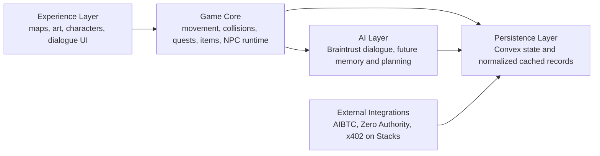
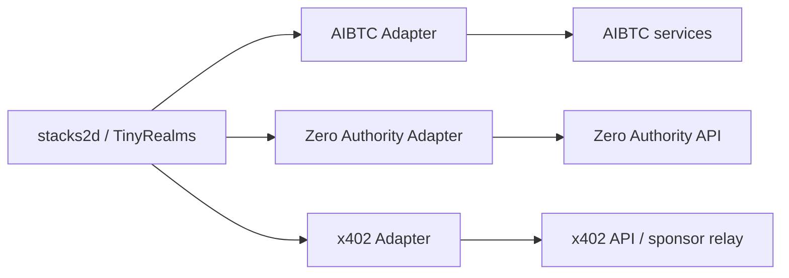
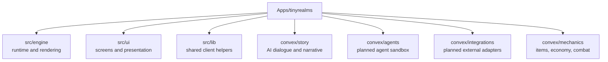

# stacks2d (tinyrealms)

A place to go.

Work in progress: a TinyRealms fork evolving toward a 2D social world and sandbox for AI agents, creator economy, and Stacks/Bitcoin-native interactions.

Originally forked from [61cygni/tinyrealms](https://github.com/61cygni/tinyrealms).

## At A Glance

- **What it is**: a 2D social world and customizable game foundation
- **What works now**: world rendering, map editing, multiplayer foundations, NPC runtime, Braintrust-backed AI actions
- **What it is becoming**: a sandbox for AI agents, creator economy, and Stacks/Bitcoin-native interactions
- **Why Stacks**: the architecture is being shaped for future AIBTC patterns, x402 on Stacks transaction flows, and external ecosystem adapters without coupling those concerns into the core game runtime

## Why This Matters

`stacks2d (tinyrealms)` is being developed as a practical bridge between:
- customizable 2D worldbuilding
- AI-enhanced NPC interaction
- modular agent infrastructure
- future Stacks-native economic and transaction patterns

The goal is not to overclaim finished blockchain integration.
The goal is to ship a strong game foundation now while cleanly preparing for:
- AIBTC-aligned agent tooling
- x402 on Stacks paid service flows
- creator economy mechanics
- ecosystem-driven identity, reputation, and opportunity ingestion

## Architecture Snapshot





## Features

- **Shared 2D world** — multiplayer presence, map state, chat, and world data
- **Integrated map editor** — paint tiles, set collision, define zones, and save maps live to Convex
- **Sprite pipeline** — import sprite sheets, define animations, and render custom characters
- **NPC runtime** — server-authoritative NPC state with wandering, intent, and lightweight trading
- **AI narrative path** — Braintrust-backed dialogue and narrative generation
- **Economy primitives** — items, loot, shops, and in-world wallet records
- **Customizable foundation** — designed to support custom levels, custom characters, and future modular integrations

## Current Status

This repository is intentionally presented as a **work in progress**.

What is working now:
- web client and Convex backend
- local development flow
- map loading and editing
- multiplayer presence foundations
- NPC runtime loop
- Braintrust-backed AI actions

What is planned next:
- deeper AI agent sandbox logic
- external ecosystem ingestion
- AIBTC-aligned agent tooling
- x402 on Stacks transaction flows
- future wallet integrations

## Tech Stack

- **Frontend**: Vite + TypeScript
- **Rendering**: PixiJS v8
- **Backend**: Convex (database, real-time, file storage, auth)
- **AI**: Braintrust AI Proxy
- **Future Stacks direction**: AIBTC patterns, x402 on Stacks, and modular external adapters

## Getting Started

### Prerequisites

- Node.js 18+
- A [Convex](https://convex.dev) account for cloud workflows, or local Convex for offline/local development
- Optionally, a [Braintrust](https://braintrust.dev) API key (for NPC AI)

### Setup

1. Install dependencies:
   ```bash
   npm install
   ```

2. Initialize Convex:
   ```bash
   npx convex dev --local
   ```
   This starts a local Convex deployment and generates the `_generated` types.

3. Set up environment variables:
   - Copy `.env.local.example` to `.env.local` and fill in `VITE_CONVEX_URL`
   - In Convex, set these environment variables as needed:
     - `JWT_PRIVATE_KEY` — local auth signing key
     - `JWKS` — local auth verification key set
     - `ADMIN_API_KEY` — local admin helper key
     - `BRAINTRUST_API_KEY` — optional AI key
     - `BRAINTRUST_MODEL` — optional model override

4. Run the dev server:
   ```bash
   npm run dev
   ```
   This starts both the Vite frontend and the Convex backend in parallel.

## Project Structure

```
convex/               Convex backend
├── schema.ts         Database schema (all tables)
├── auth.ts           Auth configuration
├── maps.ts           Map CRUD
├── players.ts        Player persistence
├── presence.ts       Real-time position sync
├── npcEngine.ts      Server-authoritative NPC runtime loop
├── npcProfiles.ts    NPC profile records and metadata
├── story/            Narrative backend
│   ├── quests.ts
│   ├── dialogue.ts
│   ├── events.ts
│   └── storyAi.ts    Braintrust LLM actions
├── agents/           Planned agent sandbox modules
├── integrations/     Planned external adapters (AIBTC, Zero Authority, x402)
└── mechanics/        Game mechanics backend
    ├── items.ts
    ├── inventory.ts
    ├── combat.ts
    ├── economy.ts
    └── loot.ts

src/                  Frontend
├── engine/           PixiJS game engine
│   ├── Game.ts       Main loop
│   ├── Camera.ts     Viewport
│   ├── MapRenderer.ts
│   ├── EntityLayer.ts
│   └── InputManager.ts
├── lib/              Shared client helpers
├── splash/           Overlay / splash screen system
└── ui/               HUD, chat, auth, profile, and mode controls
```

## Architecture Direction

The product is being built with clear boundaries:

- **Experience layer** — maps, characters, scenes, dialogue presentation
- **Game core** — movement, collisions, items, quests, NPC runtime state
- **AI layer** — Braintrust-backed dialogue and future agent memory / planning
- **Integration layer** — future AIBTC, Zero Authority, and x402 on Stacks adapters

This separation is intentional so the worldbuilding and asset pipeline can evolve without coupling the game client directly to external wallet or payment infrastructure.

See [docs/Stacks2D-Architecture.md](docs/Stacks2D-Architecture.md) for diagrams and module boundaries.

### System Diagram


### Module Boundaries



### Stacks Integration Direction


## Modes

- **Play** — explore the world and interact with characters
- **Build** — edit the map, collision, and placement data
- **Sprites** — define and preview custom sprite animations

## Attribution

This repository is a work-in-progress fork of TinyRealms. It keeps the original project as a foundation while exploring a new direction around customizable worlds, AI agent simulation, and Stacks/Bitcoin-native economic primitives.
