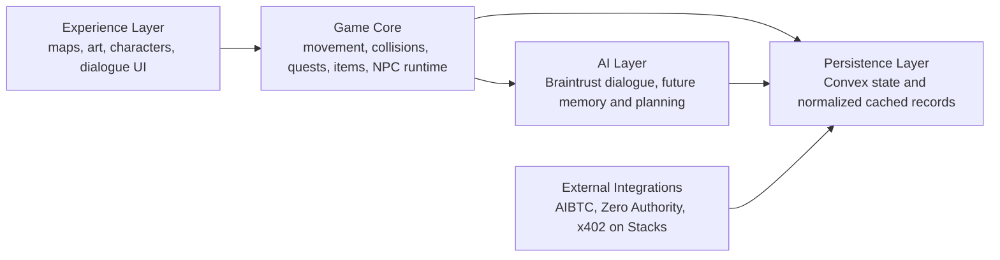
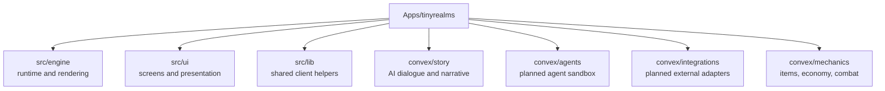
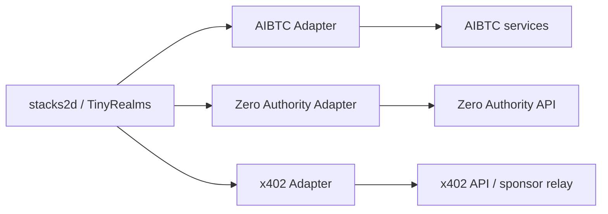

# Stacks2D Architecture

This document explains the current module boundaries for `stacks2d (tinyrealms)` and the planned path toward AIBTC- and x402-aligned integrations on Stacks.

## Product Framing

`stacks2d (tinyrealms)` is a work-in-progress 2D social world and agent sandbox.

The current codebase already supports:
- world rendering
- map editing
- sprite definitions
- multiplayer presence foundations
- NPC runtime state
- Braintrust-backed AI actions

The future direction adds:
- richer agent logic
- external ecosystem ingestion
- x402 on Stacks transaction flows
- AIBTC-aligned agent tooling

## Core Boundary

## Folder Mapping

## External Service Position

## Practical Rule

Do not merge external infrastructure into the game runtime.

Keep separate:
- game and experience
- agent logic
- external integrations
- payment infrastructure

That allows:
- faster asset and level iteration
- lower technical debt
- cleaner grant positioning
- safer future wallet work

## Stacks and AIBTC Positioning

This project should be described as:

- a work-in-progress TinyRealms fork
- building toward a 2D sandbox for AI agents and creator economy
- aligned with AIBTC patterns for agent tooling
- exploring x402 on Stacks for paid service and transaction flows

It should not be described as fully integrated with all of those systems yet.
